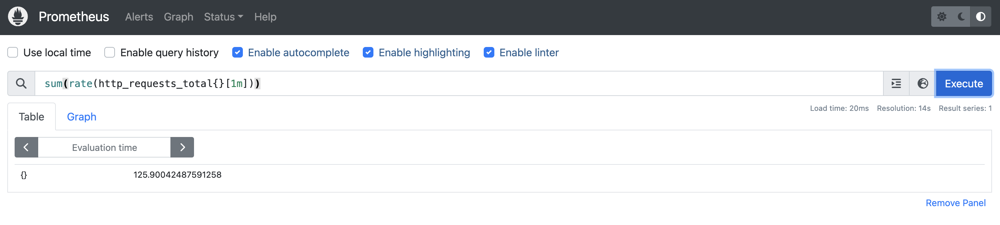

## Run Locally

Example on Minikube:

### Install Serving with KEDA support for HPA
```
MEMORY=${MEMORY:-40000}
CPUS=${CPUS:-6}

EXTRA_CONFIG="apiserver.enable-admission-plugins=\
LimitRanger,\
NamespaceExists,\
NamespaceLifecycle,\
ResourceQuota,\
ServiceAccount,\
DefaultStorageClass,\
MutatingAdmissionWebhook"

minikube start --driver=kvm2 --memory=$MEMORY --cpus=$CPUS \
  --kubernetes-version=v1.28.0 \
  --disk-size=30g \
  --extra-config="$EXTRA_CONFIG" \
  --extra-config=kubelet.authentication-token-webhook=true

kubectl apply -f https://github.com/knative/serving/releases/download/knative-v1.14.0/serving-crds.yaml
kubectl apply -f https://github.com/knative/serving/releases/download/knative-v1.14.0/serving-core.yaml
kubectl apply -f https://github.com/knative/net-kourier/releases/download/knative-v1.14.0/kourier.yaml

# Install cert-manager
kubectl apply -f ./third_party/cert-manager-latest/cert-manager.yaml

kubectl patch configmap/config-network \
  -n knative-serving \
  --type merge \
  -p '{"data":{"ingress.class":"kourier.ingress.networking.knative.dev"}}'

kubectl patch configmap/config-domain \
      --namespace knative-serving \
      --type merge \
      --patch '{"data":{"example.com":""}}'

kubectl get po -n knative-serving

NAME                                      READY   STATUS    RESTARTS   AGE
activator-58db57894b-ng4s5                1/1     Running   0          27m
autoscaler-79d9fb98c-d79lg                1/1     Running   0          27m
autoscaler-keda-hpa-88cdb8764-kncd6       1/1     Running   0          3m45s
controller-d4645478c-ncqv5                1/1     Running   0          27m
net-kourier-controller-6559c556d7-g8mcg   1/1     Running   0          27m
webhook-dddf6fcff-k99gl                   1/1     Running   0          27m

start minikube tunnel on another terminal

# install Prometheus and KEDA

cat ../values.yaml
kube-state-metrics:
  metricLabelsAllowlist:
   - pods=[*]
   - deployments=[app.kubernetes.io/name,app.kubernetes.io/component,app.kubernetes.io/instance]
prometheus:
  prometheusSpec:
    serviceMonitorSelectorNilUsesHelmValues: false
    podMonitorSelectorNilUsesHelmValues: false
grafana:
  sidecar:
    dashboards:
      enabled: true
      searchNamespace: ALL

helm repo add prometheus-community https://prometheus-community.github.io/helm-charts
helm repo add kedacore https://kedacore.github.io/charts
helm repo update

helm install prometheus prometheus-community/kube-prometheus-stack -n default -f values.yaml
helm install keda kedacore/keda --namespace keda --create-namespace

$ kubectl get po
NAME                                                     READY   STATUS    RESTARTS   AGE
alertmanager-prometheus-kube-prometheus-alertmanager-0   2/2     Running   0          117m
metrics-test-00001-deployment-5f797f796d-r7tmw           2/2     Running   0          106m
prometheus-grafana-d5679d5d7-q2pth                       3/3     Running   0          118m
prometheus-kube-prometheus-operator-ffc85ddd8-g2wvx      1/1     Running   0          118m
prometheus-kube-state-metrics-8759cbf44-jw49l            1/1     Running   0          118m
prometheus-prometheus-kube-prometheus-prometheus-0       2/2     Running   0          117m
prometheus-prometheus-node-exporter-q5qzv                1/1     Running   0          118m


# Install KEDA autoscaler
ko apply -f config/
```

### Run a ksvc with Keda HPA support

Apply the [service.yaml](./test/test_images/metrics-test/service.yaml) and wait for the service to be ready.

```
ko apply -f ./test/test_images/metrics-test/service.yaml
```

### Let's create some traffic

```
for i in {1..1000}; do curl -H "Host: metrics-test.default.example.com " http://192.168.39.233:32370; done

kubectl get ksvc
NAME           URL                                       LATESTCREATED        LATESTREADY          READY   REASON
metrics-test   http://metrics-test.default.example.com   metrics-test-00001   metrics-test-00001   True    

kubectl get hpa
NAME                 REFERENCE                                  TARGETS       MINPODS   MAXPODS   REPLICAS   AGE
metrics-test-00001   Deployment/metrics-test-00001-deployment   263m/5 (avg)   1         10        10         27m

kubectl get scaledobjects
NAME                 SCALETARGETKIND      SCALETARGETNAME                 MIN   MAX   TRIGGERS     AUTHENTICATION   READY   ACTIVE   FALLBACK   PAUSED    AGE
metrics-test-00001   apps/v1.Deployment   metrics-test-00001-deployment   1     10    prometheus                    True    True     False      Unknown   27m


kubectl get po
NAME                                                     READY   STATUS    RESTARTS   AGE
alertmanager-prometheus-kube-prometheus-alertmanager-0   2/2     Running   0          120m
metrics-test-00001-deployment-5f797f796d-29qrb           2/2     Running   0          19s
metrics-test-00001-deployment-5f797f796d-86zmd           1/2     Running   0          4s
metrics-test-00001-deployment-5f797f796d-gfdjl           2/2     Running   0          4s
metrics-test-00001-deployment-5f797f796d-jms64           2/2     Running   0          19s
metrics-test-00001-deployment-5f797f796d-kblz4           2/2     Running   0          50s
metrics-test-00001-deployment-5f797f796d-kf4pd           2/2     Running   0          19s
metrics-test-00001-deployment-5f797f796d-r7tmw           2/2     Running   0          108m
metrics-test-00001-deployment-5f797f796d-rmqs5           2/2     Running   0          50s
metrics-test-00001-deployment-5f797f796d-t5mcq           2/2     Running   0          19s
metrics-test-00001-deployment-5f797f796d-vd4jm           2/2     Running   0          50s
prometheus-grafana-d5679d5d7-q2pth                       3/3     Running   0          120m
prometheus-kube-prometheus-operator-ffc85ddd8-g2wvx      1/1     Running   0          120m
prometheus-kube-state-metrics-8759cbf44-jw49l            1/1     Running   0          120m
prometheus-prometheus-kube-prometheus-prometheus-0       2/2     Running   0          120m
prometheus-prometheus-node-exporter-q5qzv                1/1     Running   0          120m
```

After traffic is send target replicas are increases to 5. The reason is that we have set a threshold for scaling to be 5 for that metric.
Let's see what Prometheus reports during peak load (`kubectl port-forward -n default svc/prometheus-operated 9090:9090`:



The full configuration is shown next:

```
        autoscaling.knative.dev/minScale: "1"
        autoscaling.knative.dev/maxScale: "10"
        autoscaling.knative.dev/target: "5"
        autoscaling.knative.dev/class: "hpa.autoscaling.knative.dev"
        autoscaling.knative.dev/metric: "http_requests_total"
        autoscaling.knative.dev/query: "sum(rate(http_requests_total{}[1m]))"
```

After some cooldown period replicas are terminated back to 1:
```
kubectl get po
NAME                                                     READY   STATUS        RESTARTS   AGE

NAME                                                     READY   STATUS        RESTARTS   AGE
alertmanager-prometheus-kube-prometheus-alertmanager-0   2/2     Running       0          125m
metrics-test-00001-deployment-5f797f796d-gfdjl           1/2     Terminating   0          5m42s
metrics-test-00001-deployment-5f797f796d-r7tmw           2/2     Running       0          114m
prometheus-grafana-d5679d5d7-q2pth                       3/3     Running       0          126m
prometheus-kube-prometheus-operator-ffc85ddd8-g2wvx      1/1     Running       0          126m
prometheus-kube-state-metrics-8759cbf44-jw49l            1/1     Running       0          126m
prometheus-prometheus-kube-prometheus-prometheus-0       2/2     Running       0          125m
prometheus-prometheus-node-exporter-q5qzv                1/1     Running       0          126m
```

## Roadmap

- Support more functionality wrt hpa configuration compared to the original autoscaler-hpa
- Add e2e tests (Kind)
- Allow user to specify a ScaledObject instead of auto-creating it (non managed mode). Useful also for the KServe integration.
- HA support
- OCP Instructions
